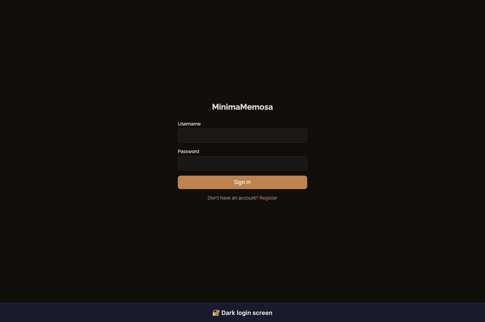

# MinimaMemosa

A lightweight, self-hosted memo/notes app built for minimal resource usage (~5–10MB idle RAM, max 100MB).

> **▶ Try the live demo: [https://minimamemosa.onrender.com](https://minimamemosa.onrender.com)**

<p align="center">
  
</p>

## Features

- **Memos-style timeline** — Notes displayed in a date-grouped chronological feed
- **WYSIWYG editor (Tiptap)** — Rich text editing with slash commands, headings, bold, italic, lists, code blocks, blockquotes, tables, todo lists
- **Markdown rendering** — Server-side rendering via pulldown-cmark (headings, lists, code blocks, tables, images)
- **File attachments** — Drag-and-drop or upload files; inserted as markdown links/images
- **Visibility** — Per-memo visibility: Public / Protected / Private
- **Edit & Delete** — Inline edit form, delete with confirmation
- **Tags** — Add `#tags` in notes, filter by tag from sidebar
- **Calendar heatmap** — Visual activity calendar showing which days have memos
- **Search** — Full-text search across all memos
- **Rich sidebar** — Icon bar with Timeline (search + calendar), Notes, and Resources views
- **First line as title** — Auto-extracts the first line of each memo as its title
- **Register & Login** — bcrypt password hashing, HMAC-signed HTTP-only session cookies
- **Dark mode** — Client-side toggle with localStorage persistence
- **HTMX-driven** — No JavaScript frameworks; server-rendered HTML fragments

## Tech Stack

| Layer | Technology | Target / Measured Idle RAM |
|-------|-----------|-----------|
| Backend | Rust + Axum + Tokio | ~5.0 MB (Target) / **~2.8 MB** (Measured Idle) |
| Database | Embedded SQLite (WAL mode, low cache) | ~1.5 MB |
| Templates | minijinja (SSR) | 0.0 MB |
| Frontend | HTMX + Tiptap + Turndown + Tailwind CSS (CDN) | 0.0 MB (Server-side) |
| Container | Alpine Linux (Docker) | ~0.5 MB |

## Quick Start

### Local development

```bash
cargo build --release
./target/release/minimamemosa
# or for development:
cargo run
```

Open http://localhost:3000

### Docker (published image)

The app is published to `ghcr.io/niteenautade/minimamemosa`. Create a `docker-compose.yml`:

```yaml
services:
  minimamemosa:
    image: ghcr.io/niteenautade/minimamemosa:latest
    ports:
      - "3000:3000"
    environment:
      - PORT=${PORT:-3000}
      - SESSION_SECRET=${SESSION_SECRET:-change-me-to-a-random-secret}
      - DATABASE_PATH=/app/data/minimamemosa.db
    volumes:
      - ./data:/app/data
    restart: unless-stopped
```

```bash
docker compose up -d
```

Or build from source:

```bash
docker compose up --build
```

## Configuration

| Env variable | Default | Description |
|--------------|---------|-------------|
| `PORT` | `3000` | HTTP listen port |
| `DATABASE_PATH` | `data/minimamemosa.db` | SQLite database file path |
| `SESSION_SECRET` | `minimamemosa-default-secret-change-me` | HMAC key for session signing |

## Testing

```bash
cargo test
```

Runs 165+ unit tests covering the database layer, authentication tokens, password hashing, CAPTCHA, rate limiting, markdown rendering, HTML stripping, tag extraction, date formatting, and all utility functions.

## Endpoints

| Method | Path | Description |
|--------|------|-------------|
| GET | `/` | Redirects to `/app` |
| GET/POST | `/login` | Login page/handler |
| GET/POST | `/register` | Registration page/handler |
| GET | `/logout` | Clears session |
| GET | `/app` | Main timeline view |
| POST | `/memos` | Create a new memo (HTMX) |
| PUT | `/memos/:id` | Update a memo (HTMX) |
| DELETE | `/memos/:id` | Delete a memo |
| POST | `/resources` | Upload file attachment (multipart) |
| GET | `/resources/:id` | Serve uploaded file |
| DELETE | `/resources/:id` | Delete a resource |
| GET | `/resources-feed` | Resources panel fragment (HTMX) |
| GET | `/notes-panel` | Notes list fragment (HTMX) |
| GET | `/note/:id` | Single note detail fragment (HTMX) |
| GET | `/memos-feed` | Timeline feed fragment (HTMX) |
| GET | `/search` | Search/filter memos by query or date (HTMX) |
| GET | `/sidebar-timeline` | Timeline sidebar with search + calendar (HTMX) |
